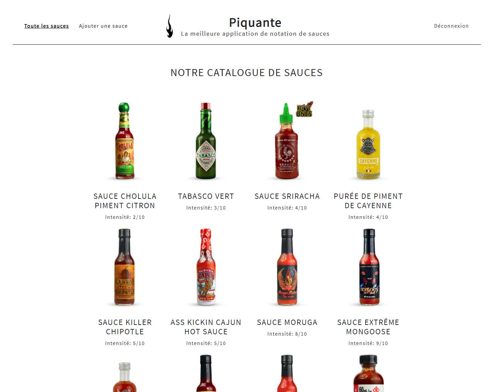

# Projet-6 : Construisez une API sécurisée pour une application d'avis gastronomiques

<b>Technologies utilisées :</b>

● framework : Express ; 
● serveur : NodeJS ; 
● base de données : MongoDB ; 
● toutes les opérations de la base de données doivent utiliser le pack Mongoose avec
des schémas de données stricts. 
● Sécurité OWASP et RGPD

<b>Dépôt GitHub :</b>

Le lien du dépôt GitHub pour la partie frontend est le suivant : https://github.com/OpenClassrooms-Student-Center/dwj-projet6

<b>Procédure :</b>

● Frontend :

Installer les dépendances: npm install

Lancer: npm start

● Backend :

Installer les dépendances: npm install

Lancer: nodemon server

<b>Scénario :</b>  
Développement d'une application web nommée "Piquante" dans laquelle les utilisateurs pourront ajouter leurs sauces préférées et liker ou disliker les sauces proposées par les autres utilisateurs.
Le but est de créer le backend de l'application, le frontend étant déjà codé et fourni. 

<b>Remarques sur l'évaluation</b>

1. Implémenter un modèle logique de données conformément à la réglementation

Validé

2. Stocker des données de manière sécurisée

Validé

3. Mettre en œuvre des opérations CRUD de manière sécurisée

Validé

<b>Livrable</b>

Points forts :

LIvrables au complet et présence d'un README dans le repo
La création du fichier .env est une bonne chose (attention dans la vraie vie à ne pas le commiter)
Code propre, bien indenté
Utilisation maline des middlewares (password + rateLimiter)
Un travail de fond autour de la sécurité
Axes d'amélioration :

Avoir un versionning plus régulier
Utiliser les valeurs par défaut dans mongoose (ex: like + dislike)  
<b>Soutenance</b>

Remarques :

La présence du support de présentation est une bonne chose
De très bonnes explications, très claires
Une bonne maîtrise technique dans son ensemble
